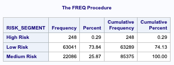

# Client Risk Segmentation & Collections Strategy

This project predicts loan default risk and segments clients into actionable risk categories (High, Medium, Low) to support early collections intervention strategies. Built using the **Home Credit Default Risk dataset**, the project simulates real-world credit risk analytics work — ideal for financial institutions.

---

## Tools & Technologies

- **SAS** – Feature engineering, logistic regression, scoring, segmentation
- **Logistic Regression** – Used for binary classification (`TARGET = 1` → default)

---

## Problem Statement

**How can we predict which clients are likely to default on their loan, and proactively assign the right collections strategy before delinquency occurs?**

---

## Features Engineered

| Feature                  | Description |
|--------------------------|-------------|
| `AGE_YEARS`              | Client age in years |
| `EMPLOYED_YEARS`         | Employment duration (capped) |
| `CREDIT_INCOME_RATIO`    | Credit amount relative to income |
| `ANNUITY_INCOME_RATIO`   | Annuity relative to income |
| `LOAN_GOODS_DIFF`        | Difference between loan & goods price |
| `Bureau Aggregates`      | External credit total, debt, and overdue |

---

## Model Output

After training a logistic regression model on 100,000 clients, each test client is scored (`P_1`) with the **probability of default**. Clients are then segmented:

| Risk Segment | Probability (`P_1`) Threshold | Strategy |
|--------------|-------------------------------|----------|
| High Risk    | ≥ 0.20                        | Call within 24h + offer payment plan |
| Medium Risk  | 0.10–0.199                    | SMS + call after 7 days |
| Low Risk     | < 0.10                        | Email reminder only |

---

## Repo Structure

collection-risk-segmentation/ ├── sas/ │ ├── main_modeling_script.sas │ ├── scoring_and_segmentation.sas ├── python/ │ ├── data_trimming_google_colab.ipynb ├── output/ │ ├── test_clients_scored.csv ├── README.md

---

## Business Impact

This approach enables the collections team to:
- Prioritize high-risk clients for early outreach
- Reduce roll rates and operational costs
- Integrate risk scoring directly into CRM workflows

---

## 🔍 Sample Output

Here’s how clients were segmented by risk:

Each test client was assigned a risk score and strategy:

---
## Notes

- Data used is from the [Home Credit Default Risk](https://www.kaggle.com/competitions/home-credit-default-risk) public dataset.
- Code is compatible with SAS.
- Dataset trimmed to 100K records per file to meet SAS OnDemand file size limits.

---

## Author

**Riya Aggarwal** 

