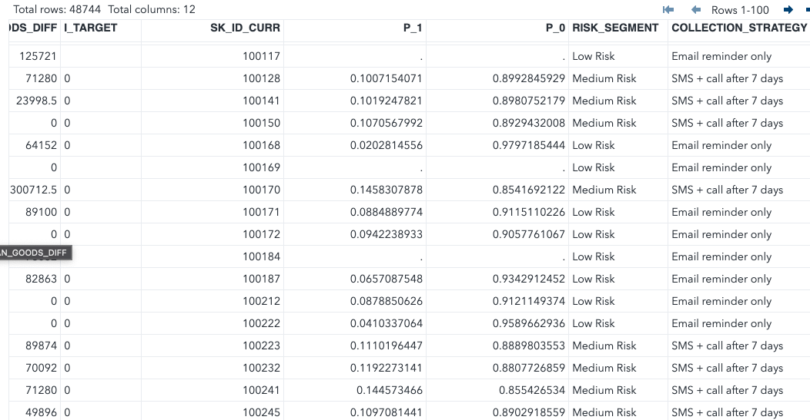

# Client Risk Segmentation & Collections Strategy

This project predicts loan default risk and segments clients into actionable risk categories (High, Medium, Low) to support early collections intervention strategies. Built using the **Home Credit Default Risk dataset**, the project simulates real-world credit risk analytics work — ideal for financial institutions.

---

## Tools & Technologies

- **SAS** – Feature engineering, logistic regression, scoring, segmentation
- **Logistic Regression** – Used for binary classification (`TARGET = 1` → default)

---

## Problem Statement

**How can we predict which clients are likely to default on their loan, and proactively assign the right collections strategy before delinquency occurs?**

---

## Features Engineered

| Feature                  | Description |
|--------------------------|-------------|
| `AGE_YEARS`              | Client age in years |
| `EMPLOYED_YEARS`         | Employment duration (capped) |
| `CREDIT_INCOME_RATIO`    | Credit amount relative to income |
| `ANNUITY_INCOME_RATIO`   | Annuity relative to income |
| `LOAN_GOODS_DIFF`        | Difference between loan & goods price |
| `Bureau Aggregates`      | External credit total, debt, and overdue |

---

## Model Output

After training a logistic regression model on 100,000 clients, each test client is scored (`P_1`) with the **probability of default**. Clients are then segmented:

| Risk Segment | Probability (`P_1`) Threshold | Strategy |
|--------------|-------------------------------|----------|
| High Risk    | ≥ 0.20                        | Call within 24h + offer payment plan |
| Medium Risk  | 0.10–0.199                    | SMS + call after 7 days |
| Low Risk     | < 0.10                        | Email reminder only |

---

## Repo Structure

collection-risk-segmentation/ ├── sas/ │ ├── main_modeling_script.sas │ ├── scoring_and_segmentation.sas ├── python/ │ ├── data_trimming_google_colab.ipynb ├── output/ │ ├── test_clients_scored.csv ├── README.md

---

## Business Impact

This approach enables the collections team to:
- Prioritize high-risk clients for early outreach
- Reduce roll rates and operational costs
- Integrate risk scoring directly into CRM workflows

---

## 🔍 Sample Output

Here’s how clients were segmented by risk:

Each test client was assigned a risk score and strategy:

---
## Notes

- Data used is from the [Home Credit Default Risk](https://www.kaggle.com/competitions/home-credit-default-risk) public dataset.
- Code is compatible with SAS.
- Dataset trimmed to 100K records per file to meet SAS OnDemand file size limits.

---

## Next Steps

I aim to expand this study in several impactful ways:

- ** Incorporate Bureau Data into the Model**  
  Although bureau features were aggregated and joined, they were not yet used in model training. I aim to include important variables like total debt, overdue amounts, and number of active external credits to improve predictive power. 

- **Model Performance Tuning**  
  Evaluate the model using AUC/ROC curves and confusion matrices. Ill explore alternative thresholds, feature scaling, or nonlinear transformations to better separate high-risk clients.

- **Handle Class Imbalance**  
  Since defaults are relatively rare (`TARGET=1`), I will explore techniques like oversampling (SMOTE), undersampling, or weight adjustments to balance the data and improve recall.

- **Trying Alternative Algorithms**  
  Ill evaluate model performance from popular tree-based models (e.g., decision trees, random forest, gradient boosting) using Python (scikit-learn or XGBoost) for potentially stronger classification.

- ** Deploy Risk Score in Real-Time Simulation**  
  Integrate scoring into a simulated dashboard or decision engine that takes in new applications and recommends a collection strategy dynamically.

## Author

**Riya Aggarwal** 

